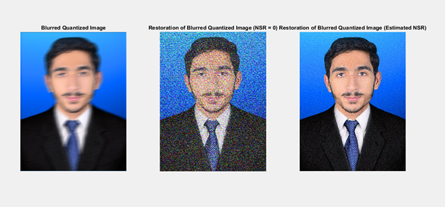
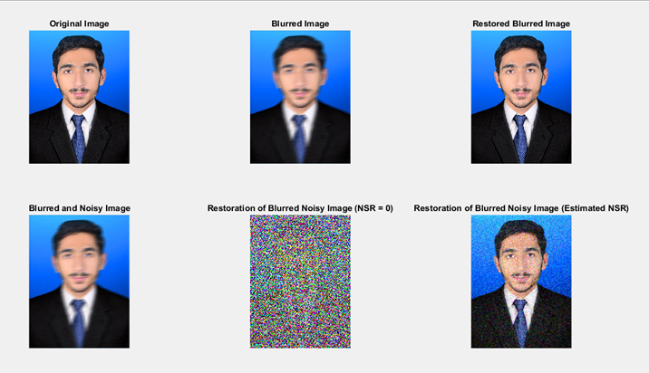
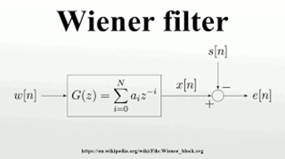

# 🧠 Image Deblurring Project

[]()
[](LICENSE)

A Signals & Systems course project that simulates and restores blurred images using MATLAB. It explores motion blur, Gaussian noise, quantization, and Wiener filtering for image restoration.

---

## 📌 Project Highlights

- Implemented image blurring and deblurring using MATLAB
- Used Wiener Filter for deblurring with and without noise
- Analyzed image restoration using NSR estimation
- Explored impact of motion blur, Gaussian noise, and quantization

---

## 🛠️ Tools & Technologies

- MATLAB (Image Processing Toolbox)
- (Optional) C source files included for experimentation
- PDF Reports
- Flowchart Diagrams & Visualizations

---
## 📁 Folder Structure

```plaintext
image-deblurring-project/
├── assets/         # Screenshots and visual outputs
├── docs/           # Report and proposal PDFs
├── src/            # (optional source files)
├── README.md       # Project description
├── .gitignore

```
---

## 🧪 Key Algorithms & Filters

- Motion Blur PSF
- Gaussian Noise Addition
- Wiener Filter for Deblurring
- NSR Estimation
- Image Quantization Restoration

---

## 📷 Visual Preview

### 📌 Processing Pipeline


### 🖼️ Output Image (Wiener Filter Result)


### 🔁 Filter in Action

---
## 🚀 How to Run

1. Open the MATLAB `.m` script from the `src/` folder.
2. Make sure the image path is correct in the script.
3. Run the script to simulate blur and apply Wiener filtering.


---

## 📜 Documentation

- 📄 [Image Deblurring Project Report (PDF)](docs/Image_Deblurring_Project_Report.pdf)
- 📄 [Project Proposal (PDF)](docs/Image_Deblurring_Project_Proposal.pdf)

---

## 👨‍💻 Developed By

- **Ibad Ur Rahman** — Algorithm Developer & Analyst  
- **Khalid Hussain** — Report Writer & Visualization Specialist  

---

## 🔐 License

This project is created for academic purposes. MIT License © 2025 Ibad Ur Rahman Memon

